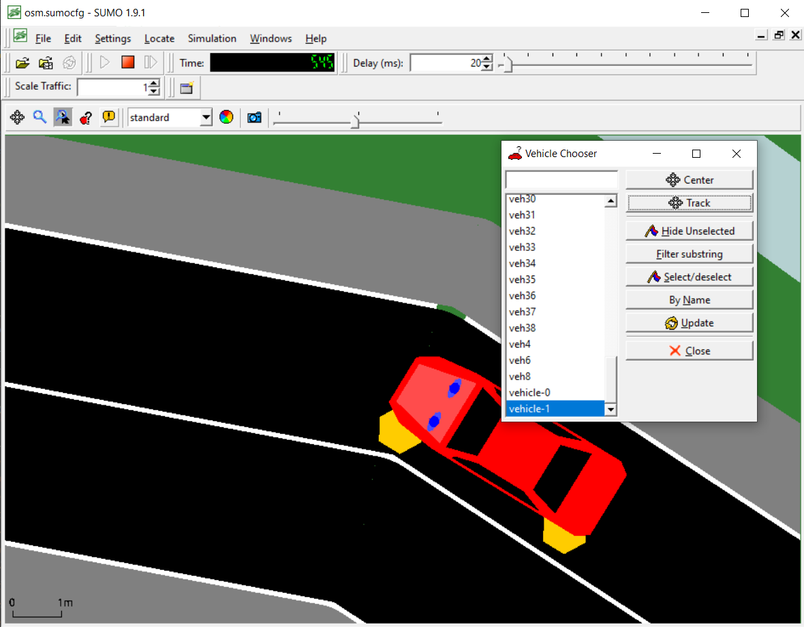
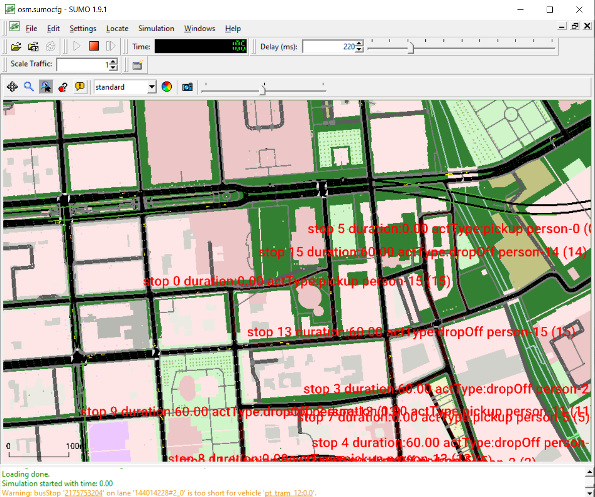

To run this project, first install SUMO (Simulation Of Urban Mobility) with sumo-gui included. Set appropriate variable 
SUMO_HOME. To activate the local environment on Windows, run .\agent-env\Scripts\activate.

Then, run simulateTaxi.py from directory marshrutki with two numerical arguments denoting the number of 
passengers and vehicles in the simulation. To start the simulation itself, you have to click on the 
green arrow in the later popped out window.

Marshrutki (multi-person taxis) are marked as red in the simulation. To track and observe one, choose a car
with name starting with vehicle, as in the visualization below.

You can also toggle the visualization of the current route for the marshrutka by clicking on the car and
choosing to hide or show the current route. Results and visualizations available below.

To generate routes as appropriate for vehicles of type taxi according to SUMO guidelines, run:

python randomTrips.py -n config-smaller-berlin/osm.net.xml --trip-attributes="departLane=\"best\" departSpeed=\"max\" departPos=\"random\"" --
additional-file config-smaller-berlin/add.xml -o config-smaller-berlin/output-trips.xml -e 50 --validate